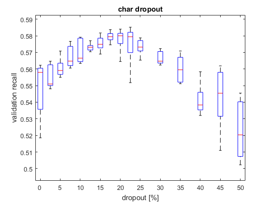
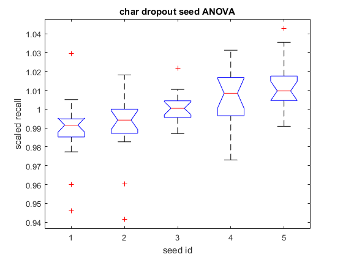
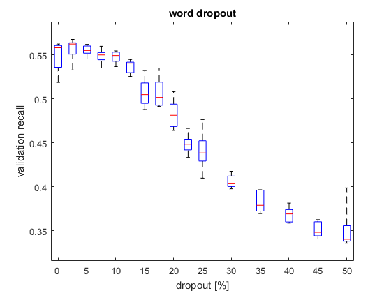
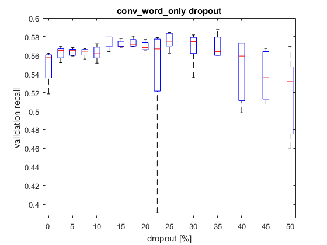
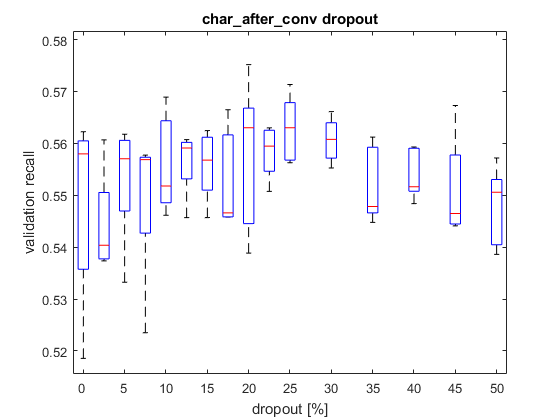
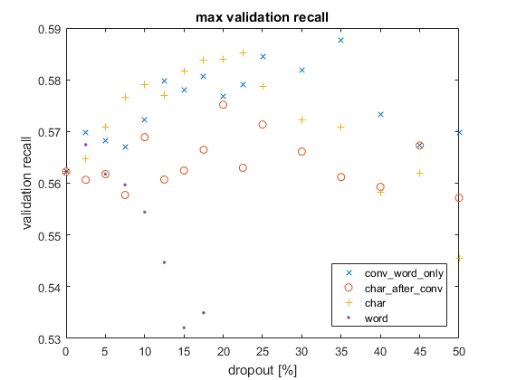

# twitter-sentiment - WORK IN PROGRESS

## Intro

This is my Machine Learning project that I'm currently working on,
Twitter sentiment analysis (3-point scale) using character-input LSTM network with attention mechanism.
Implemented in Python 2.7 with Lasagne (0.2.dev1) and Theano (0.8.2.dev-RELEASE).
In my implementations of layers I reuse some Lasagne's code.

Data from SemEval-2017 Task 4A: 
http://alt.qcri.org/semeval2017/task4/index.php?id=data-and-tools 
and from Sentiment140: 
http://help.sentiment140.com/for-students

The problem: given a tweet predict its overall sentiment - negative, neutral or positive.

## Structure

### get_data.py

The script uses data from 5 separate locations:
* http://alt.qcri.org/semeval2017/task4/data/uploads/download.zip
* http://alt.qcri.org/semeval2017/task4/data/uploads/codalab/4a-english.zip
* http://alt.qcri.org/semeval2017/task4/data/uploads/semeval2016_task4_submissions_and_scores.zip
* http://alt.qcri.org/semeval2017/task4/data/uploads/semeval2017-task4-test-input-phase1-v3.0.zip
* http://cs.stanford.edu/people/alecmgo/trainingandtestdata.zip

You need to download and extract the files to `data\extracted`. Since Twitter's TOS specifies you cannot
share downloaded tweets, some datasets include only tweet
ids and labels. The script downloads all of those that still exist, but it needs your Twitter credentials.
You should rename `get_data_template.cfg` to `get_data.cfg` and provide them there.
The program loads all the data into one format and pickles it into separate files.

Then it unescapes HTML entities into proper characters. The script gets all the
characters and symbols used in all the datasets except Stanford into one charset. Then it loops through all the tweets
in the Stanford dataset to filter out those that contain characters not included in this charset.

Some of the SemEval tweets in training and validation datasets intersect. Also some tweets are repeated. The script
handles both issues.

Running the script results in 4 datasets: pretrain (filtered Stanford), validation (SemEval dev2017),
test (SemEval test2017), train (all SemEval data left). The choice of validation and test data allows result comparison
(http://alt.qcri.org/semeval2017/task4/index.php?id=results). The data is stored in 1-hot encoding.

### A little bit off-topic

While working with unicode data, I learned that Python 2.x binaries can be compiled in two different modes, narrow and
wide, which may lead to some bizarre behavior of the Unicode string class.
Most commonly-used characters are coded in unicode with BMP (Basic Multilingual Plane). Each plane in unicode
represents 2^16 codepoints (2 bytes to address each point). So most commonly-used characters in utf-8 are
coded using at most 2 bytes. But in case of characters and symbols from outside the BMP it is necessary to
use more than 2 bytes per symbol.

Python 2.x compiled in narrow mode uses (internally) 2 bytes
for each symbol and if a symbol needs more bytes - it is stored as a surrogate pair of 2-byte words. As long as it is
just the internal representation of the interpreter, I shouldn't bother with it. But when you ask such a build
of Python about the length of a unicode string, it will give you the amount of 2-byte words instead. This
is the reason why some of the tweets in the datasets are longer than 140 characters (which is the Twitter's limit).

The problem could be solved by using a wide build that utilizes 4 bytes per symbol. The wide build wasn't available for
my platform and compiling the interpreter would be an overkill. So would be writing a class inheriting from Unicode
string and implementing proper `__length__()`, `next()` and more methods. Quite a big part of the BMP is
reserved for 'private use'. It means I could map all troublesome symbols into it and use the analogs instead. But
identifying all of them would be time-consuming. After all I decided to just leave them be and let the LSTMs figure
everything out, with a price of a slightly higher memory footprint (max tweet length becomes 151 instead of 140).

Reference: https://www.python.org/dev/peps/pep-0261/

### data_wrapper.py

As I was experimenting with huge amounts of tweets, they didn't fit in my RAM at once. DataWrapper class takes care
of this issue by dividing the data into chunks that are dynamically loaded on demand. It also shuffles the data, allows
easy batch iteration and offers a nice interface for data usage.

The class speeds up data loading. Just instantiate an object with `create_chunks=True` once, so it creates the whole
temporary structure. Then, if you keep the parameters constant, you can reuse the structure by creating an object
with `create_chunks=False`.

### evaluation_helper.py

EvaluationHelper class takes care of model evaluation.

### lstm_dt_layer.py

LSTMDTLayer class implements LSTM with Deep Transition, based on 
Razvan Pascanu, Caglar Gulcehre, Kyunghyun Cho, Yoshua Bengio 
How to Construct Deep Recurrent Neural Networks, 2014, 
https://arxiv.org/abs/1312.6026

It inherits from Lasagne's LSTMLayer and it utilizes its code heavily.

### attention.py

AttentionLayer class implements attention mechanism, as in 
Soren Kaae Sonderby, Casper Kaae Sonderby, Henrik Nielsen, Ole Winther, 
Convolutional LSTM Networks for Subcellular Localization of Proteins, 2015, 
https://arxiv.org/abs/1503.01919

It produces an attention value for each time step of LSTM output. Then it uses the values to compute a weighted sum.
Therefore, the network pays different attention to each symbol to produce one vector representing the tweet.

### word_dropout.py

WordDropoutLayer class implements a special version of dropout I thought the model may benefit from.
Regular dropout layer would set each input to zero with some probability p. This layer sets groups of inputs (each group
corresponding to a word in the original input) to zero, each with some probability p.

### block/block.py and block/train_block.py

BlockLayer class implements a layer with 2 inputs: usual input and control input. Based on the control input the
usual input is set to zero or passed. There's also a training script that utilizes the layer in a model.

It was supposed to bring sparsity to the network and improve performance, but it doesn't. I put it in a separate
directory not to clutter the main folder.

### train.py

The main training script. It loads the data, builds the specified model and trains the network. All the parameters
are explained in the top comment of the script.

Structure of the full model (DRP - dropout, DT - deep transition, DI - deep input, DO - deep output): 
INPUT - DRP - CONVOLUTION - MAXPOOL - N\*(- DRP - DI - LSTM(+/-DT) - DO) - ATTENTION - DENSE - SOFTMAX

## The story

I started with a basic 2 stacked layers LSTM network. As I learned during my MSc project, it's an OK starting point.
Then I began adding more and more fancy solutions to reach a full model as presented in the diagram above.
I ran plenty experiments in order to see how each augmentation improves (or worsens) the model. For the nomenclature used
here please consult the legend below.

<table>
<tr><td colspan=2>LEGEND</td></tr>
<tr><td>nLSTM</td><td>n stacked layers LSTM</td></tr>
<tr><td>mCnn</td><td>m stacked convolution layers with nn filters of each size in each layer, stride=1</td></tr>
<tr><td>mCnns2</td><td>m stacked convolution layers with nn filters of each size in each layer, stride=1 in the 1st layer and stride=2 in the rest</td></tr>
<tr><td>MPn</td><td>n stacked maxpool layers with stride=2</td></tr>
<tr><td>An</td><td>attention mechanism with n stacked feedforward layers</td></tr>
<tr><td>Dn</td><td>n layers dense network after the attention layer</td></tr>
<tr><td>BLK</td><td>block layer</td></tr>
<tr><td>DTn</td><td>deep transition - n layers feedforward network</td></tr>
<tr><td>In</td><td>deep input - n layers feedforward network</td></tr>
<tr><td>On</td><td>deep output - n layers feedforward network</td></tr>
</table>

All models were fixed to have approximately 1 or 2 millions parameters. Units in each layer were distributed equally, except
for the convolution layer, which had a fixed number of params. The convolution layer had either 10 filters of each size
(50 filters in total) or 20 filters of each size (100 filters in total). The filter sizes were always 3, 5, 7, 13 and 21
characters. With 565 unique characters, a 1C10+3LSTM+DT1+A1+D1 1M have the parameters distributed as follows:

<table>

<tr><td align=right>1C10</td><td>28%</td>
<td>276900 = 565*3*10+10 + 565*5*10+10 + 565*7*10+10 + 565*13*10+10 + 565*21*10+10</td></tr>

<tr><td align=right>1LSTM</td><td>17%</td>
<td>170775 = 4*(165*50 + 165*165 + 165) + 3*165 + 2*165 + 165*165 + 165</td></tr>

<tr><td align=right>2&3LSTM</td><td>2x25%</td>
<td>493350 = 2*246675 = 2*(4*(165*165 + 165*165 + 165) + 3*165 + 2*165 + 165*165 + 165)</td></tr>

<tr><td align=right>A1</td><td>2.8%</td>
<td>27555 = 165*165 + 165 + 165</td></tr>

<tr><td align=right>D1</td><td>2.7%</td>
<td>27390 = 165*165 + 165</td></tr>

<tr><td align=right>SOFTMAX</td><td>0.5%</td>
<td>498 = 165*3 + 3</td></tr>

<tr><td align=right>total</td><td>100%</td>
<td>996468</td></tr>

</table>

The computations were done with two different machines:
a laptop with GeForce GT 730M (most 1M nets) and a PC with GeForce GTX 750 Ti (most 2M nets). In both cases
CUDA was utilized, but only the latter used cuDNN implementation of the convolution layer.

In order to properly compare different architectures, I should have run each experiment multiple times with different
RNG seeds, but I didn't want to spend so much time on computation.
Instead, I ran a set of 8 (or 4) different settings for each architecture (2 network sizes, 2 learning rates and
2 convolution layer sizes) with a constant 'good enough' value of dropout.
It allows to compare the architectures between each other with a certain accuracy and yet saves much computation.
I believe it is a fair compromise.

The table below depicts results of the experiments on SemEval-2017 data (without Stanford 1.6M). Each cell represents one
experiment in a format `val/test/epochs`, where `val` is the maximum recall on the validation set, `test` is
the according recall value on the test set and `epochs` is the number of training epochs needed to reach this
value. By recall I mean a macroaveraged recall, which is the evaluation measure in the SemEval-2017 Task 4A contest
(http://alt.qcri.org/semeval2017/task4/). The highest value on the test data obtained in the competition was 0.681.

The emojis indicate that a result is:
* :green_apple: - better than previous best
* :lemon: - equal to the previous best
* :tomato: - worse than the previous best

separately for each setting (e.g. 1M 5e-4 1C10).

We can see that some augmentations clearly bring higher performance, some architectures give slightly ambiguous
results and some clearly worsen the outcome.

It's amazing, how a little amount of parameters the attention mechanism uses compared to the great performance boost
it gives. The effect of this ingenious concept is clearly seen in the table below. Its
influence can be noticed by comparing performance of 2LSTM+A1 to pure 2LSTM, but also Cnn+2LSTM+A1 to Cnn+2LSTM.

Application of convolution layer is also beneficial, but not to such an extent. It's worth noticing that the convolution
layer limits the 1-hot (565 orthogonal elements) input to a vector of either 50 or 100 real numbers and by doing that it
improves the performance of the model. Smaller convolution performs better in simpler models, but when utilized together
with the attention mechanism the bigger convolution layer becomes more favourable. The relative difference in
performance may reach a couple percent, so it may be worthwhile to investigate how an even bigger and stacked
convolution layers perform.

Convolution and attention mechanism provide a great performance increase. Augmenting the model with deep transition
and dense layer pushes the performance even higher, but the gains become lower and lower. These augmentations always
(except for one case) bring higher or at least equal performance within each setting. It is clear that the network
benefits from them as well.

Adding an extra LSTM layer (3 stacked layers instead of 2) delivers the best result so far across all settings,
but not all particular settings benefit from it. Nevertheless, it seems to be the best performing architecture so far.

Introducing block, deep input and deep output layers worsens the performance, except for the 1M 5e-4 1C20 case, which
is slightly better than its previous best. Still, none of these architectures beat the highest score across all
the settings.

Stacking 3 layers in deep transition or deepening the dense network (2 or 3 layers) is clearly deteriorating the
performance. Only 2 single results are insignificantly higher than the previous ones in their respective settings.

The results of DT2+D1 architecture are a little ambiguous. Most of them are worse, two reach the previous best and one
(1C20 2M 5e-4) sets the record for the best result so far across all settings (0.3% increase). The average result achieved
by this architecture is 0.5% lower than DT1+D1. These two architectures deliver comparable performance and there are many
arguments for and against both of them. In my arbitrary decision I chose to go on with the DT1+D1.
Mainly, because it is simpler.

Introducing extra stacked feedforward layers in the attention mechanism (A2 and A3) does not increase the performance.

<table>

<tr>
<td>Architecture</td>
<td colspan=2 align=center>1M</td>
<td colspan=2 align=center>2M</td>
</tr>

<tr align=center>
<td></td>
<td>5e-4</td>
<td>1e-3</td>
<td>5e-4</td>
<td>1e-3</td>
</tr>

<tr align=center>
<td align=right>2LSTM</td>
<td>0.417/0.393/5</td>
<td>0.397/0.378/8</td>
<td>0.415/0.398/17</td>
<td>0.411/0.392/11</td>
</tr>

<tr align=center>
<td align=right>1C10+2LSTM 1C20+2LSTM</td>
<td>:green_apple:0.504/0.482/56 :green_apple:0.486/0.461/32</td>
<td>:green_apple:0.496/0.467/56 :green_apple:0.447/0.431/16</td>
<td>:green_apple:0.445/0.421/13 :green_apple:0.448/0.428/30</td>
<td>:green_apple:0.447/0.416/33 :green_apple:0.444/0.421/36</td>
</tr>

<tr align=center>
<td align=right>2LSTM+A1</td>
<td>:green_apple:0.510/0.488/56</td>
<td>:green_apple:0.541/0.511/56</td>
<td>:green_apple:0.485/0.457/24</td>
<td>:green_apple:0.518/0.489/24</td>
</tr>

<tr align=center>
<td align=right>1C10+2LSTM+A1 1C20+2LSTM+A1</td>
<td>:green_apple:0.557/0.537/23 :green_apple:0.562/0.544/24</td>
<td>:green_apple:0.561/0.525/19 :green_apple:0.569/0.546/19</td>
<td>:green_apple:0.563/0.538/23 :green_apple:0.569/0.537/26</td>
<td>:green_apple:0.556/0.535/17 :green_apple:0.570/0.536/34</td>
</tr>

<tr align=center>
<td align=right>1C10+2LSTM+A1+D1 1C20+2LSTM+A1+D1</td>
<td>:tomato:0.554/0.543/15 :green_apple:0.563/0.545/22</td>
<td>:green_apple:0.563/0.544/25 :green_apple:0.571/0.552/14</td>
<td>:green_apple:0.568/0.544/28 :green_apple:0.572/0.546/25</td>
<td>:green_apple:0.567/0.549/17 :green_apple:0.571/0.552/13</td>
</tr>

<tr align=center>
<td align=right>1C10+2LSTM+A1+D1+BLK 1C20+2LSTM+A1+D1+BLK</td>
<td>:tomato:0.541/0.519/30 :tomato:0.519/0.510/26</td>
<td>:tomato:0.562/0.529/22 :tomato:0.547/0.517/18</td>
<td>:tomato:0.518/0.503/18 :tomato:0.530/0.511/17</td>
<td>:tomato:0.548/0.520/25 :tomato:0.530/0.513/14</td>
</tr>

<tr align=center>
<td align=right>1C10+2LSTM+DT1+A1+D1 1C20+2LSTM+DT1+A1+D1</td>
<td>:green_apple:0.566/0.548/22 :green_apple:0.570/0.556/19</td>
<td>:green_apple:0.571/0.557/22 :lemon:0.571/0.557/13</td>
<td>:lemon:0.568/0.546/23 :green_apple:0.573/0.551/21</td>
<td>:green_apple:0.574/0.561/23 :green_apple:0.578/0.555/15</td>
</tr>

<tr align=center>
<td align=right>1C10+3LSTM+DT1+A1+D1 1C20+3LSTM+DT1+A1+D1</td>
<td>:green_apple:0.569/0.545/29 :tomato:0.566/0.529/35</td>
<td>:green_apple:0.574/0.548/34 :tomato:0.566/0.542/19</td>
<td>:green_apple:0.574/0.547/28 :green_apple:0.581/0.557/28</td>
<td>:tomato:0.564/0.541/13 :green_apple:0.582/0.555/17</td>
</tr>

<tr align=center>
<td align=right>1C10+I1+3LSTM+DT1+A1+D1 1C20+I1+3LSTM+DT1+A1+D1</td>
<td>:tomato:0.559/0.528/36 :tomato:0.543/0.509/21</td>
<td>:tomato:0.543/0.513/24 :tomato:0.465/0.452/07</td>
<td>:tomato:0.553/0.528/36 :tomato:0.549/0.519/17</td>
<td>:tomato:0.533/0.504/34 :tomato:0.536/0.505/18</td>
</tr>

<tr align=center>
<td align=right>1C10+3LSTM+DT1+O1+A1+D1 1C20+3LSTM+DT1+O1+A1+D1</td>
<td>:tomato:0.560/0.532/41 :green_apple:0.575/0.543/26</td>
<td>:tomato:0.572/0.541/33 :tomato:0.557/0.527/22</td>
<td>:tomato:0.566/0.534/31 :tomato:0.566/0.532/30</td>
<td>:tomato:0.553/0.519/15 :tomato:0.556/0.520/24</td>
</tr>

<tr align=center>
<td align=right>1C10+3LSTM+DT2+A1+D1 1C20+3LSTM+DT2+A1+D1</td>
<td>:tomato:0.564/0.539/42 :lemon:0.575/0.545/34</td>
<td>:tomato:0.568/0.543/16 :lemon:0.571/0.543/20</td>
<td>:tomato:0.557/0.539/17 :green_apple:0.584/0.562/26</td>
<td>:tomato:0.562/0.535/11 :tomato:0.572/0.553/14</td>
</tr>

<tr align=center>
<td align=right>1C10+3LSTM+DT3+A1+D1 1C20+3LSTM+DT3+A1+D1</td>
<td>:tomato:0.558/0.537/22 :tomato:0.517/0.490/26</td>
<td>:tomato:0.554/0.529/19 :tomato:0.568/0.545/20</td>
<td>:tomato:0.564/0.550/31 :tomato:0.574/0.554/23</td>
<td>:tomato:0.557/0.536/17 :tomato:0.578/0.555/15</td>
</tr>

<tr align=center>
<td align=right>1C10+3LSTM+DT2+A1+D2 1C20+3LSTM+DT2+A1+D2</td>
<td>:tomato:0.568/0.542/41 :tomato:0.571/0.549/22</td>
<td>:tomato:0.560/0.537/30 :green_apple:0.575/0.547/18</td>
<td>:tomato:0.555/0.535/22 :tomato:0.582/0.554/22</td>
<td>:tomato:0.568/0.549/18 :tomato:0.571/0.553/25</td>
</tr>

<tr align=center>
<td align=right>1C10+3LSTM+DT3+A1+D3 1C20+3LSTM+DT3+A1+D3</td>
<td>:tomato:0.563/0.543/39 :green_apple:0.576/0.550/31</td>
<td>:tomato:0.567/0.541/29 :tomato:0.561/0.529/25</td>
<td>:tomato:0.570/0.545/28 :tomato:0.576/0.553/20</td>
<td>:tomato:0.570/0.541/31 :tomato:0.579/0.552/27</td>
</tr>

<tr align=center>
<td align=right>1C10+3LSTM+DT1+A2+D1 1C20+3LSTM+DT1+A2+D1</td>
<td>:tomato:0.561/0.539/22 :tomato:0.562/0.543/21</td>
<td>:tomato:0.565/0.545/15 :tomato:0.571/0.544/13</td>
<td>:tomato:0.566/0.540/28 :tomato:0.564/0.535/35</td>
<td>:tomato:0.554/0.524/22 :tomato:0.566/0.541/21</td>
</tr>

<tr align=center>
<td align=right>1C10+3LSTM+DT1+A3+D1 1C20+3LSTM+DT1+A3+D1</td>
<td>:tomato:0.551/0.534/23 :tomato:0.546/0.528/21</td>
<td>:tomato:0.557/0.527/18 :tomato:0.565/0.541/20</td>
<td>:tomato:0.551/0.527/26 :tomato:0.556/0.524/26</td>
<td>:tomato:0.559/0.526/23 :tomato:0.558/0.516/34</td>
</tr>

<tr align=center>
<td align=right>BEST 1C10 BEST 1C20</td>
<td>0.569/0.545/29 0.576/0.550/31</td>
<td>0.574/0.548/34 0.575/0.547/18</td>
<td>0.574/0.547/28 0.584/0.562/26</td>
<td>0.574/0.561/23 0.582/0.555/17</td>
</tr>

</table>

I picked the 3LSTM+DT1+A1+D1 as the model with the highest potential from the first set of experiments. Next, I decided to
play with the convolutions a bit.
I gave a new C30 size a try and introduced 2 stacked convolution layers in two variants:
* stride=1 in both layers (2C10, 2C20 and 2C30)
* stride=1 in the 1st and stride=2 in the 2nd layer (2C10s2 and 2C20s2).

I also experimented with a maxpool layer with stride=2 between the convolutions and LSTMs (1C10+MP1 and 1C20+MP1).

None of the augmentations improved the performance.
However, it is worth noticing that maxpool didn't ruin the outcome
(the results are just slightly lower than without maxpool), even though it halves the LSTM time-length.
The MP1 augmentation actually brings higher performance in case of 1C20 1M 5e-4 and 1C10 2M 1e-3.

In contrast, the 2C10s2 and 2C20s2 delivered worse results than maxpool or 2 stacked convolutions with stride=1.
The results are presented in the table below.

2C30 and 3C30 architectures hold more than 1M parameters in the convolution layers, so 1M models were not possible to run.

<table>

<tr>
<td>3LSTM+DT1+A1+D1</td>
<td colspan=2 align=center>1M</td>
<td colspan=2 align=center>2M</td>
</tr>

<tr align=center>
<td></td>
<td>5e-4</td>
<td>1e-3</td>
<td>5e-4</td>
<td>1e-3</td>
</tr>

<tr align=center>
<td align=right>1C10 1C20 1C30</td>
<td>0.569/0.545/29 0.566/0.529/35 0.566/0.535/30</td>
<td>0.574/0.548/34 0.566/0.542/19 0.569/0.551/24</td>
<td>0.574/0.547/28 0.581/0.557/28 0.574/0.551/24</td>
<td>0.564/0.541/13 0.582/0.555/17 0.578/0.559/17</td>
</tr>

<tr align=center>
<td align=right>2C10 2C20 2C30</td>
<td>0.551/0.525/26 0.571/0.541/20 x</td>
<td>0.556/0.527/21 0.571/0.548/12 x</td>
<td>0.564/0.543/26 0.576/0.549/23 0.576/0.547/21</td>
<td>0.564/0.537/17 0.577/0.549/13 0.574/0.551/14</td>
</tr>

<tr align=center>
<td align=right>2C10s2 2C20s2</td>
<td>0.539/0.514/16 0.547/0.518/30</td>
<td>0.533/0.505/16 0.553/0.531/14</td>
<td>0.543/0.526/22 0.555/0.537/18</td>
<td>0.552/0.522/18 0.558/0.539/11</td>
</tr>

<tr align=center>
<td align=right>1C10+MP1 1C20+MP1</td>
<td>0.561/0.544/28 0.567/0.530/28</td>
<td>0.550/0.532/14 0.558/0.539/11</td>
<td>0.562/0.546/28 0.575/0.558/17</td>
<td>0.568/0.555/17 0.568/0.555/23</td>
</tr>

</table>

The slightly superior performance of the 2M models over 1M networks can be seen in the tables above, especially in case of
more complex architectures.
It seems worthwhile to investigate how the performance is affected by increasing the number of parameters even further.
I trained a 3LSTM+DT1+A1+D1 3M model, but it gave worse results than the 2M.
Perhaps, more training data would mitigate this problem. The results are presented in the table below.

<table>

<tr>
<td></td>
<td colspan=2 align=center>1M</td>
<td colspan=2 align=center>2M</td>
<td colspan=2 align=center>3M</td>
</tr>

<tr align=center>
<td></td>
<td>5e-4</td>
<td>1e-3</td>
<td>5e-4</td>
<td>1e-3</td>
<td>5e-4</td>
<td>1e-3</td>
</tr>

<tr align=center>
<td align=right>1C10 1C20</td>
<td>0.569/0.545/29 0.566/0.529/35</td>
<td>0.574/0.548/34 0.566/0.542/19</td>
<td>0.574/0.547/28 0.581/0.557/28</td>
<td>0.564/0.541/13 0.582/0.555/17</td>
<td>0.564/0.540/20 0.570/0.560/21</td>
<td>0.571/0.551/30 0.580/0.563/20</td>
</tr>

</table>

### A little bit off-topic v2

In the meantime I tried to speedup the evaluation of the networks (the big_eval_batch branch).
I compiled a generic model, that can work with any batch size and then
I increased the batch size in the forward pass, since it is less memory demanding than backpropagation.
The generic approach turned out to be more time consuming while training and the benefit of big batch
evaluation was canceled out.
However, introducing two parallel models with shared parameters allowed to decrease the overall computation time.

Utilizing 9 times bigger batches for evaluation purposes gave only a couple percent boost with same memory footprint
in 2M case. It shows that the major limiting factor is the data transfer to and from the GPU.
Since the benefit was mediocre and the complexity of the script greatly increased, I dropped the idea.

### Back to the story - dropout analysis

I decided to finetune the dropout value in 3LSTM+DT1+A1+D1 training. The values I investigated are:
0, 2.5, 5, 7.5, 10, 12.5, 15, 17.5, 20, 22.5, 25, 30, 32.5, 35, 40, 45, 50 [%].

First, I experimented with the typical dropout, which I call `char`, since it applies zeroes randomly to all connections.
I repeated each experiment 5 times, with a different RNG seed. I used the same set of 5 seeds for each dropout value.

The figure below presents the box plot of the `char` dropout experiment results.
Dropout value on x, validation dataset recall on y axis.
We can see that the best value (0.585) is obtained with dropout value of 22.5%. Moving in any direction from this
value decreases the performance.

I also wanted to learn how the seed influences the final results. I took all the results from the previous experiment and
scaled them with regard to the mean value for each dropout value. I grouped the results for each seed separately and
did a simple ANOVA. The figure below presents the variance of scaled results for each seed separately. We can see that indeed
there is a fair correlation between the initial state of the network and the final performance.
MATLAB's anova1 function delivers a very small p-value (7e-5), which also indicates that the differences between the seeds
are significant.

Then I evaluated performance of the `word` dropout. I designed this special version of dropout that also applies
zeroes randomly,
but it does so in relation to the original input, for each word separately.
For example, if the input was 'Yeah, for your recovery.' the dropout values could look like:

<table><tr><td>Y</td><td>e</td><td>a</td><td>h</td><td>,</td><td> </td><td>f</td><td>o</td><td>r</td><td> </td><td>y</td><td>o</td><td>u</td><td>r</td><td> </td><td>r</td><td>e</td><td>c</td><td>o</td><td>v</td><td>e</td><td>r</td><td>y</td><td>.</td></tr>
<tr><td>1</td><td>1</td><td>1</td><td>1</td><td>1</td><td>1</td><td>0</td><td>0</td><td>0</td><td>1</td><td>1</td><td>1</td><td>1</td><td>1</td><td>1</td><td>0</td><td>0</td><td>0</td><td>0</td><td>0</td><td>0</td><td>0</td><td>0</td><td>0</td></tr></table>

There is a 1 for each space and a set of 1s or 0s, sampled once for each word, including all special characters.
I implemented this version having in mind that maybe it will make it easier for the network to grasp the abstract of a word.
Again, I repeated each experiment 5 times with the same set of seeds as before.

The next figure depicts the box plot of the `word` dropout results. The best value (0.567) is achieved with dropout 2.5%.
The `word` dropout doesn't increase the performance compared to `char` type. But it is beneficial compared to using
no dropout at all.

The convolution layer at the bottom of the network is kind of special. In a way that it serves as a filter between
the input and LSTMs. Therefore, I examined yet another dropout solution - `conv_word_only`, which stands for `word`
dropout
between the input and convolution layer and `char` dropout between any other layers. The motivation, again, was to make it
easier for the network to understand the word formation, but this time only at the level of filters.

The figure below presents the box plot of the `conv_word_only` dropout results. The best value (0.588) is achieved with
dropout fraction 35%. This is the new highest validation recall value. Apparently, `conv_word_only` helped the model
reach a slightly better result.

On the other hand, it might be the case that only removing the dropout from the convolution layer was the reason for
higher score compared to full `char` dropout. To investigate it, I ran the whole set of `char` dropout experiments
again, but with dropout totally removed from from the convolution layer. Let's call it `char_after_conv`.

The results are presented in the next figure. The best value (0.575) is achieved with dropout fraction 20%. We can see that
simply removing the dropout from the convolution layer doesn't help the model. Hence, the `conv_word_only`
does improve the performance.

To conclude the 4 previous dropout experiments, I plotted the maximum values obtained for each dropout type and fraction.
It is presented in the figure below. The `word` dropout quickly disappears behind the x scale. `char_after_conv` never
(except one case) scores the highest value. For dropout fractions between 0 and 22.5% `char` dropout reaches the top value
most of the times. In case of dropout fractions >=25% `conv_word_only` always performs the best (at 45% it's approximately
ex aequo with `char_after_conv`).

This results imply that it might be worth to investigate separate values of dropout fraction in `conv_word_only` case.
More precisely, a higher value for `word` dropout in the convolution layer and a smaller one for `char` dropout in
all the other layers (e.g. 35% and 22.5%).

TO BE CONTINUED...
